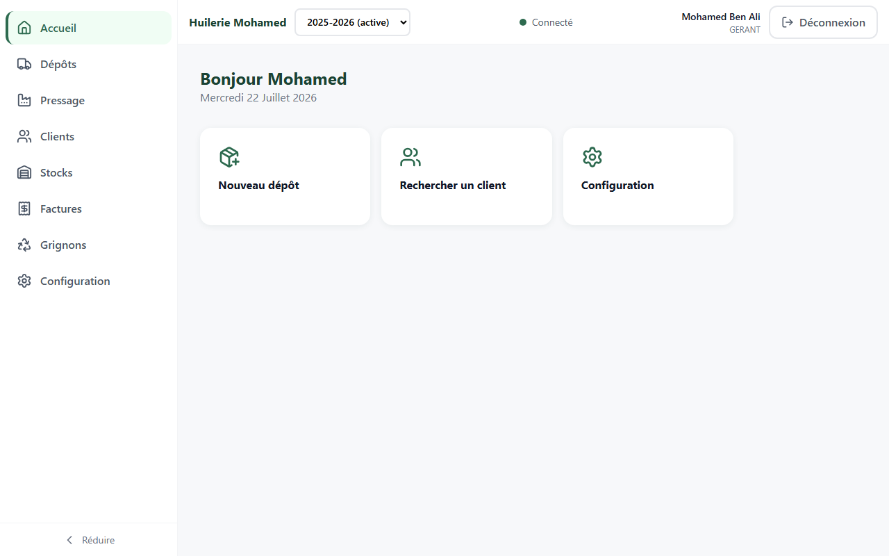
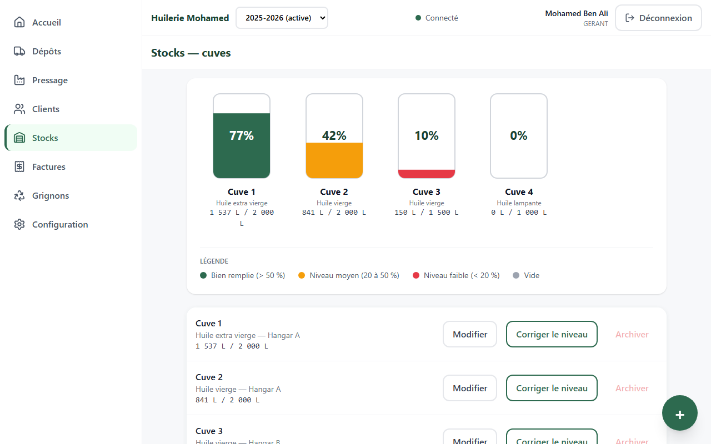
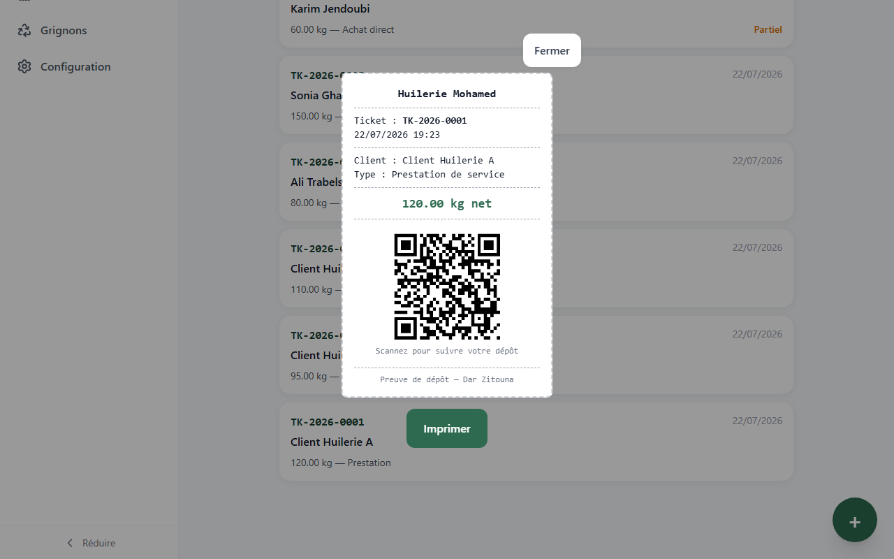
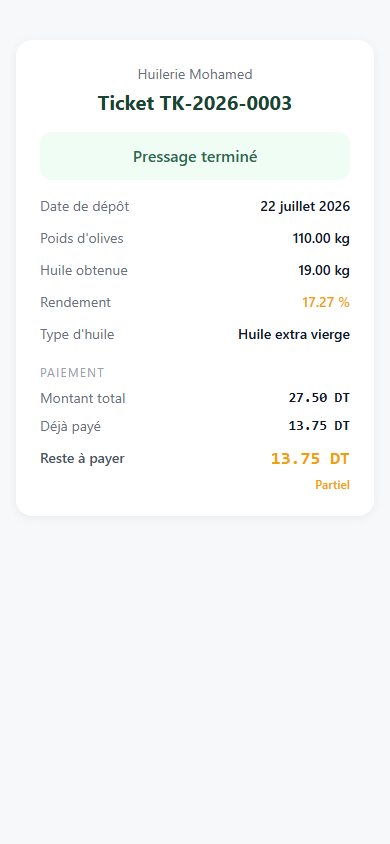

# Dar Zitouna

ERP tablette **offline-first** pour la gestion d'une huilerie d'olives en Tunisie — dépôts, pressage, cuves, facturation et suivi client, utilisable sans réseau fiable au cœur de la campagne.

---

## Aperçu visuel

| Dashboard gérant | Cuves — niveaux en direct |
|---|---|
|  |  |

| Ticket de dépôt avec QR code | Portail public agriculteur (mobile) |
|---|---|
|  |  |

D'autres captures (facturation, wizard de dépôt, mode hors ligne, vues par rôle, résultats de tests) sont disponibles dans [`docs/captures/`](docs/captures/).

---

## Fonctionnalités

- **Dépôts & ticket QR** — enregistrement d'un dépôt d'olives (pesée, achat direct ou prestation de service), génération d'un ticket imprimable avec QR code pointant vers le portail public.
- **Pressage** — clôture d'un dépôt en pressage : quantité d'huile obtenue, rendement calculé, cuve de destination.
- **Cuves** — vue d'ensemble visuelle (canvas coloré par niveau de remplissage), correction manuelle de niveau tracée, archivage.
- **Facturation** — génération de facture depuis un pressage, règlements partiels ou multiples, statut de paiement toujours recalculé (jamais stocké en dur).
- **Clients** — fiche agrégée par client (historique dépôts/pressages/factures/règlements, reste dû), recherche, archivage soft-delete.
- **Configuration** — gestion des saisons (ouverture, clôture avec bilan, sélecteur de saison en lecture seule pour consulter les archives) et du personnel (rôles, PIN).
- **Portail agriculteur public** — page `/t/<token>` sans authentification : l'agriculteur scanne le QR de son ticket et consulte l'état de son dépôt (en attente / pressé, montants, reste à payer) à tout moment, sans rien installer.
- **Mode hors ligne (PWA)** — application installable, données de consultation mises en cache et disponibles sans réseau, bandeau d'état visible, écritures bloquées proprement plutôt que silencieusement échouées.
- **Rôles** — Gérant (accès complet) et Opérateur (saisie quotidienne, actions sensibles masquées et bloquées côté base).

---

## Stack technique

| Domaine | Choix |
|---|---|
| Frontend | React 19, TypeScript (strict), Vite, Tailwind CSS v4 |
| Routage | React Router 7 |
| Backend | Supabase (PostgreSQL, Auth, PostgREST), toute la logique métier en base (RLS, triggers, fonctions RPC) |
| Hors ligne | vite-plugin-pwa (Workbox) — precache de l'application, cache runtime des données consultées |
| Tests | Vitest (logique métier, 322 tests), Playwright (vérifications bout en bout en développement) |
| Qualité | ESLint, TypeScript strict, GitHub Actions |

---

## Architecture

### Trois environnements

```
Local (Docker, Supabase CLI)  →  Previews Cloudflare Pages (staging, par branche)  →  Production (déploiement conditionné à la CI verte)
```

- **Local** : Supabase tourne dans Docker via la CLI, schéma et données de test rejouables à volonté (`supabase db reset`).
- **Staging** : chaque branche/pull request obtient automatiquement une URL de prévisualisation Cloudflare Pages, adossée au projet Supabase Cloud.
- **Production** : domaine dédié, déployé uniquement depuis `main` et uniquement si la CI est verte (voir [CI/CD](#cicd)).

### Organisation de `src/`

```
src/
├── components/   composants d'interface réutilisables (modales, bandeaux, sélecteurs, cartes…)
├── hooks/        hooks React (statut réseau, pagination, focus trap, contexte de saison…)
├── lib/          logique métier pure et accès Supabase — testée indépendamment de l'UI
├── pages/        un composant par écran/route
├── tests/        tests Vitest, un fichier par module de src/lib
└── types/        types TypeScript partagés (miroir du schéma de base)
```

Le principe directeur : **le moins de logique possible dans les composants**. Les calculs, l'accès aux données et les règles métier vivent dans `src/lib/`, testables sans rendu React ; les pages orchestrent l'UI et consomment cette couche.

### Schéma de base — source de vérité

Le schéma n'est jamais décrit "à la main" : les 16 fichiers de [`supabase/migrations/`](supabase/migrations/), appliqués dans l'ordre chronologique de leur nom, constituent la seule source de vérité (tables, triggers, RLS, fonctions RPC). `supabase/seed.sql` fournit un jeu de données de test rejoué à chaque réinitialisation locale.

---

## Installation locale

### Prérequis

- [Node.js 22](https://nodejs.org/)
- [Docker Desktop](https://www.docker.com/products/docker-desktop/) (pour Supabase local)
- [Supabase CLI](https://supabase.com/docs/guides/cli) (`npx supabase` fonctionne sans installation globale)

### Étapes

```bash
# 1. Dépendances
npm install

# 2. Démarrer Supabase en local (Docker doit être lancé)
npx supabase start

# 3. Récupérer l'URL et la clé anonyme affichées par la commande précédente
#    (ou reconsulter à tout moment avec `npx supabase status`),
#    puis créer un fichier .env.local à la racine :
echo "VITE_SUPABASE_URL=<API_URL affichée>" > .env.local
echo "VITE_SUPABASE_ANON_KEY=<ANON_KEY affichée>" >> .env.local

# 4. Appliquer les migrations et charger les données de test
npx supabase db reset

# 5. Lancer l'application en développement
npm run dev
```

L'application est servie sur `http://localhost:5173`.

### Tester le mode PWA / hors ligne

Le service worker n'est **pas actif en mode développement** (`npm run dev`) — Workbox ne s'exécute que sur un build de production :

```bash
npm run build
npm run preview
```

L'aperçu tourne alors sur `http://localhost:4173`, service worker inclus : installation, précache et cache des données sont observables normalement (DevTools → Application → Service Workers / Cache Storage).

### Accès de démonstration (seed local uniquement)

Ces identifiants ne valent que pour les données de test rejouées par `supabase db reset` en local — aucun rapport avec un environnement de staging ou de production.

| | |
|---|---|
| Code d'activation | `ZTN-4F8K-9XQ2-M7P3` |
| Gérant | profil **Mohamed Ben Ali**, PIN `1234` |
| Opérateur | profil **Ahmed Trabelsi**, PIN `0000` |

---

## Tests & qualité

Chiffres obtenus en exécutant réellement les commandes ci-dessous sur l'état actuel du dépôt :

```bash
npx vitest run           # 37 fichiers, 322 tests, tous verts
npx vitest run --coverage
```

```
Statements   : 95.35% ( 390/409 )
Branches     : 86.30% ( 252/292 )
Functions    : 98.33% ( 118/120 )
Lines        : 99.69% ( 324/325 )
```

```bash
npx tsc -b     # 0 erreur
npx eslint .   # 0 erreur, 0 avertissement
```

Captures correspondantes : [`18-vitest-run.png`](docs/captures/18-vitest-run.png), [`19-vitest-coverage.png`](docs/captures/19-vitest-coverage.png), [`20-tsc-eslint.png`](docs/captures/20-tsc-eslint.png).

---

## CI/CD

```
Push / Pull Request  →  CI GitHub Actions (lint + tsc + tests)
                              │
                    ┌─────────┴─────────┐
                    │                   │
              branche feature      push sur main
                    │                   │
        Preview Cloudflare Pages    CI verte ?
           (staging, par PR)             │
                                    ┌─────┴─────┐
                                   oui          non
                                    │             │
                        Déploiement PRODUCTION   (rien —
                        (deploy hook Cloudflare)  le déploiement
                                                   n'est jamais
                                                   déclenché)
```

Le workflow ([`.github/workflows/ci.yml`](.github/workflows/ci.yml)) définit deux jobs :

1. **`build-and-test`** — sur chaque push et pull request vers `main` : installation des dépendances (`npm ci`), lint, compilation TypeScript (`tsc -b`), tests unitaires.
2. **`deploy-production`** — dépend du succès du premier (`needs: build-and-test`), et ne s'exécute **que** si l'événement est un push direct sur `main` (`if: github.ref == 'refs/heads/main' && github.event_name == 'push'`). Il déclenche le déploiement production via un webhook Cloudflare Pages (`CLOUDFLARE_DEPLOY_HOOK`, stocké en secret GitHub).

Autrement dit : une pull request ne peut jamais déployer en production, et un push sur `main` dont la CI échoue ne déploie rien non plus — la production est strictement conditionnée à une CI verte sur `main`.

Les previews Cloudflare Pages (staging), elles, sont générées automatiquement par l'intégration GitHub de Cloudflare pour chaque branche/PR, indépendamment de ce workflow.

---

## Sécurité

- **Isolation multi-tenant par RLS** — chaque table métier est filtrée par `huilerie_id` via des policies PostgreSQL ; aucune requête ne peut traverser les données d'une autre huilerie.
- **Claims JWT personnalisés** — un Custom Access Token Hook Supabase injecte `huilerie_id` et le rôle dans le JWT à chaque émission de token ; c'est sur ces claims que s'appuient les policies RLS, jamais sur une valeur envoyée par le client.
- **PIN haché + pont vers Supabase Auth** — le PIN de connexion est haché en bcrypt côté base (jamais transmis ni stocké en clair) ; un mot de passe dérivé (SHA-256 de `user_id:pin`) ouvre en parallèle une vraie session Supabase Auth, seule façon d'obtenir un JWT exploitable par les policies RLS.
- **Fonctions RPC `SECURITY DEFINER` whitelistées** — les seuls points d'entrée accessibles avant authentification (activation, liste des profils, vérification du PIN, consultation publique d'un ticket) sont des fonctions PostgreSQL dédiées ; le rôle `anon` n'a **aucun accès direct** aux tables.
- **Token public du portail agriculteur** — généré aléatoirement à l'insertion de chaque dépôt (~122 bits d'entropie), non énumérable, sans lien avec l'identifiant interne du dépôt.
- **Purge du cache hors ligne à la déconnexion** — les données mises en cache pour la consultation hors ligne sont supprimées au logout : le cache suit le cycle de vie de la session, pas celui de l'appareil (pertinent sur une tablette partagée entre gérant et opérateurs).

---

## Accessibilité

Développé en visant le [RGAA](https://accessibilite.numerique.gouv.fr/) :

- Contrastes de texte conformes sur l'ensemble de la palette.
- Cibles tactiles ≥ 48px sur toute action interactive.
- Attributs ARIA sur les composants complexes (combobox de recherche, modales, onglets, régions live).
- Respect de `prefers-reduced-motion` sur toutes les transitions et animations.
- Le bandeau de mode hors ligne est annoncé aux lecteurs d'écran via `aria-live="polite"`.
- Aucune information portée par la seule couleur (statuts, niveaux de cuve, rendement toujours doublés d'un libellé texte).

---

## Évolutions prévues

- **Module Grignons** — suivi et vente des sous-produits du pressage.
- **Écriture hors ligne** — file d'attente locale (IndexedDB) pour les actions effectuées sans réseau, avec synchronisation et résolution de conflits au retour de la connexion. Le mode actuel couvre la consultation hors ligne ; l'écriture hors ligne est une extension délibérément non traitée à ce stade.
